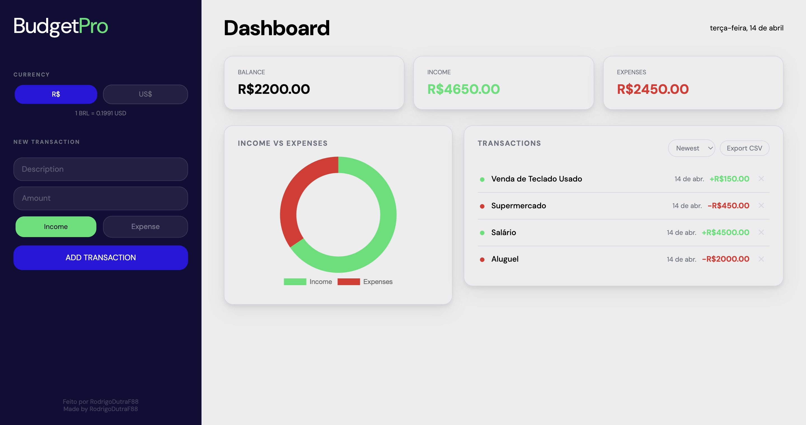

# BudgetPro

>  [Português](#português) | [English](#english)

---

## Português

📊**BudgetPro** é um dashboard simples de finanças pessoais construído com HTML, CSS e JavaScript. Possui conversão de moeda ao vivo, gráfico, filtro por tipo e outras funcionalidades.

🔗 **Live Demo:**: https://rodrigodutraf88.github.io/BudgetPro/

### Preview



### Funcionalidades

- Adicionar e deletar transações de receita e despesa
- Gráfico de rosca em tempo real utilizando `Chart.js`.
- Resumo com saldo, receita total e despesa total
- Conversão de moeda ao vivo (BRL <-> USD) via `API do Frankfurter`
- Ordenação por mais recente, mais antigo, maior ou menor valor
- Filtro por tipo (todos, receita, despesa)
- Data de cada transação exibida automaticamente
- Exportar transações como arquivo `.csv`
- Dados salvos no navegador com `localStorage`
- `Layout responsivo` -> funciona no celular e no desktop

### Tecnologias


### Como rodar

Sem instalação. Só clonar e abrir.

```bash
git clone https://github.com/RodrigoDutraF88/budgetpro.git
cd budgetpro
```

Abra o arquivo `index.html` no navegador.

### Estrutura

```
budgetpro/
├── img/
│   └── BudgetProImg.png -> imagem do projeto
├── index.html           -> estrutura da página
├── style.css            -> layout, cores e variáveis CSS
├── script.js            -> lógica da aplicação
└── README.md                 
```
---

## English

📊*BudgetPro* is a simple personal finance dashboard using HTML, CSS and JavaScript. It features a live currency conversion, chart, filter by type, and other functionalities.

### Features

- Add and delete income and expense transactions
- Real-time doughnut chart using `Chart.js` 
- Summary cards with balance, total income, and total expenses
- Live currency conversion (BRL <-> USD) using the `Frankfurter API`
- Sort transactions by newest, oldest, highest, or lowest amount
- Filter by type (all, income, expense)
- Automatic date stamp on each transaction
- Export transactions as a `.csv` file
- Data persisted in the browser using `localStorage`
- `Responsive layout` —> works on mobile and desktop

### Getting Started

No installation needed. Just clone and open.

```bash
git clone https://github.com/RodrigoDutraF88/budgetpro.git
cd budgetpro
```

Open `index.html` in your browser.

### Project Structure

```
budgetpro/
├── img/
│   └── BudgetProImg.png -> project screenshot
├── index.html           -> main page structure
├── style.css            -> layout, colors, and CSS variables
├── script.js            -> application logic 
└── README.md            
```

---

## O que aprendi 

Este projeto foi construído como meio de aprendizado e me ajudou muito a revisar, praticar, aprender e relembrar conceitos ultilizados, como: Normalize.css, metodologia BEM, :root, Chart.js, Blob, Date.now() (Obs:Não sabia que gerava número de milissegundos desde 1º de janeiro de 1970, achei muito interessante e usei esse número como id único para cada transação), !important no css, fetch() e APIs, sort(), .filter(), .splice(), async/await, push(), appendChild(), @import, CSS.grid.

No geral foi um bom meio de praticar e testar minhas habilidades em javaScript, CSS e HTML.


## What I Learned

This project was developed mainly with a learning purpose, allowing me to review, practice, and solidify several concepts, including: Normalize.css, BEM methodology, :root, Chart.js, Blob, Date.now() (Obs: I didn't know it generated the number of milliseconds since January 1st 1970, i found that to be really cool and also i used that as a ID for each transaction), !important in css, fetch() & APIs, sort(), .filter(), .splice(), async/await, push(), appendChild(), @import, CSS.grid.

Overall this was a great way to practice and test my skills in JavaScript, CSS, and HTML.
(also my english skills while writing this read.me)


---

###  Licença / License

MIT —> sinta-se livre para usar, modificar e distribuir.
MIT —> feel free to use, modify, and distribute.

---

Made by/Feito por [RodrigoDutraF88](https://github.com/RodrigoDutraF88)